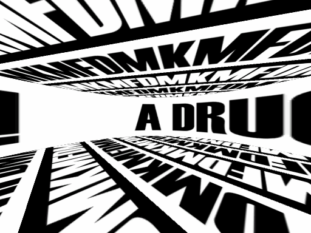

# KMFDM - A Drug Against War spinner recreation

A simple Unity project that aims to recreate [this effect from the music video for A Drug Against War by KMFDM.](https://www.youtube.com/watch?v=h6s23SGIqlk&t=56s) I couldn't find the exact font used in the video; I used Haettenschweiler instead since it's used on basically all of the band's album artwork (although they might actually use Helvecita Compressed - the jury's still out on that one).

## Result

I exclusively used the animator and ProBuilder to recreate the shot. I used [LiceCAP](https://www.cockos.com/licecap/) to record the above gif.